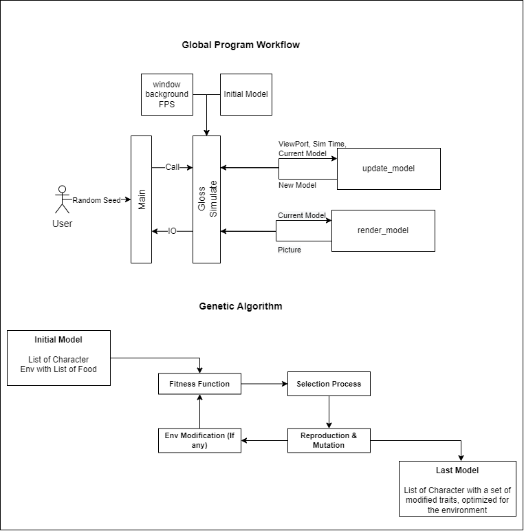

# Haskell Genetic Algorithm Simulation

**Author**: Lorys Hamadache  
**Program**: Emurgo Developer Associate Program

This project demonstrates proficiency in Haskell by implementing a **genetic algorithm simulation**, serving as a foundation for learning and working with **Plutus** and **Cardano Smart Contracts**.

---

## Project Overview

This simulation models the behavior of "Characters" within a bounded environment containing food sources. Each character possesses attributes such as speed, field of vision, and size. They move randomly but will change direction upon detecting food within their field of vision to consume it. Consuming food increases their energy, which otherwise depletes over time. Through successive generations, characters evolve traits that enhance their survival, showcasing the principles of genetic algorithms.

---

## Repository Structure

- `app/`: Contains the main source code for the simulation.
- `docs/`: Directory for documentation files.
- `dist-newstyle/`: Directory for build artifacts.
- `.gitattributes`: Git attributes configuration file.
- `CHANGELOG.md`: Log of changes and updates made to the project.
- `README.md`: This documentation file.
- `project-lorys.cabal`: Cabal configuration file for the project.
- `project_diagram.png`: Visual representation of the project structure or simulation process.

---

## Visualization

The simulation utilizes the **Gloss** library for rendering graphics, providing a visual representation of the characters' behaviors and interactions within the environment.



---

## Documentation

Comprehensive documentation is available, detailing all classes, functions, and their descriptions. Access the Haddock-generated documentation here:

[Haddock Documentation](https://loryshamadache.github.io/Haskell-Project/)

---

## Getting Started

### Prerequisites

- **Haskell Platform**: Ensure you have the Haskell Platform installed on your system.
- **Gloss Library**: The simulation relies on the Gloss library for visualization.

### Installation

1. **Clone the Repository**:

   ```bash
   git clone https://github.com/LorysHamadache/haskell-genetic-sim.git
   cd haskell-genetic-sim
   ```

2. **Build the Project**:

   ```bash
   cabal build
   ```

3. **Run the Simulation**:

   ```bash
   cabal run
   ```

---

## License

This project is licensed under the MIT License. See the `LICENSE` file for details.

---

## Contact

For questions or suggestions, please open an issue in the repository.

---

*Note: This project is provided "as-is" without warranty of any kind. Use at your own discretion.*
